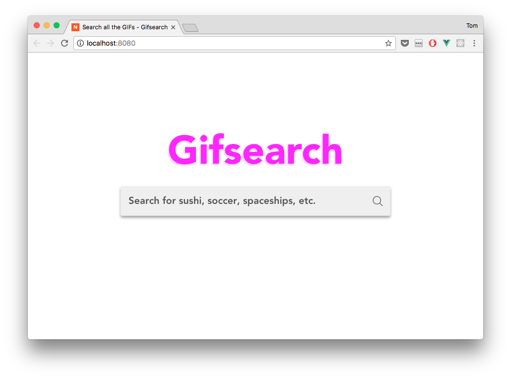
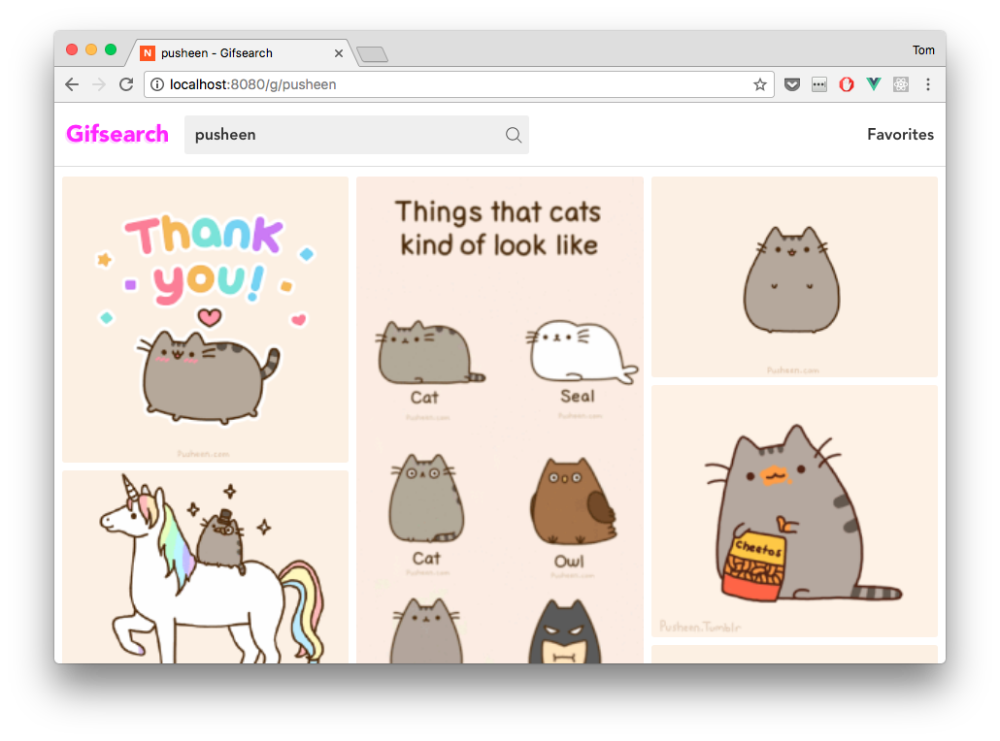
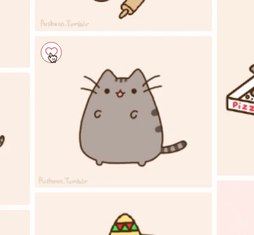
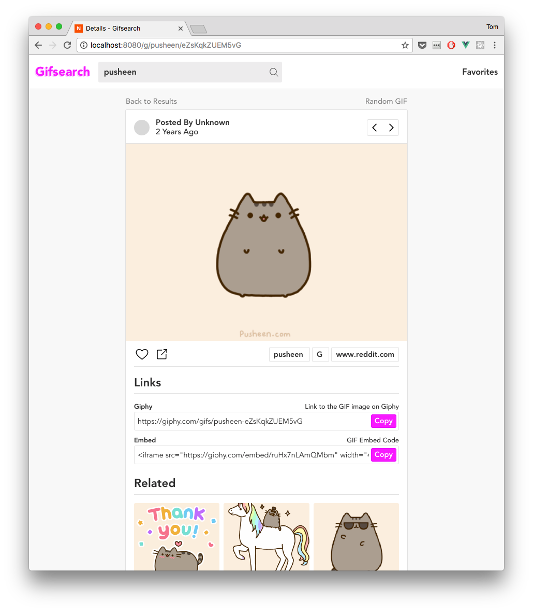
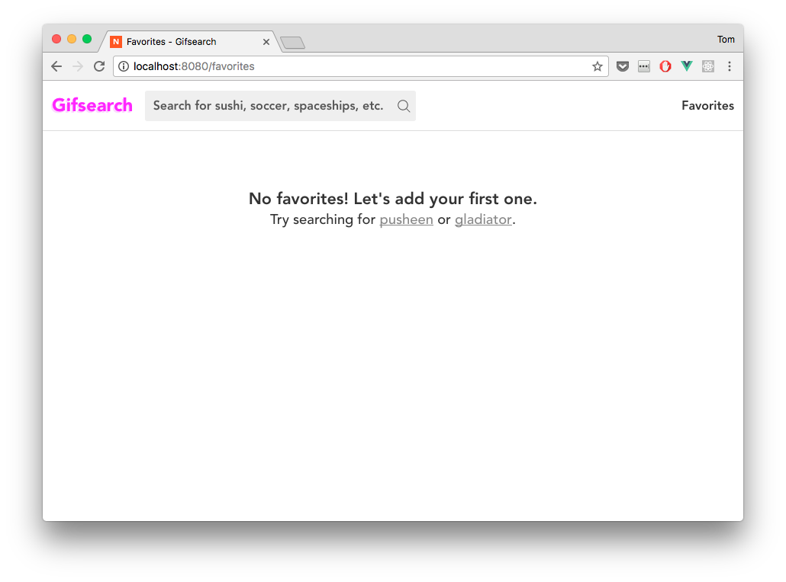
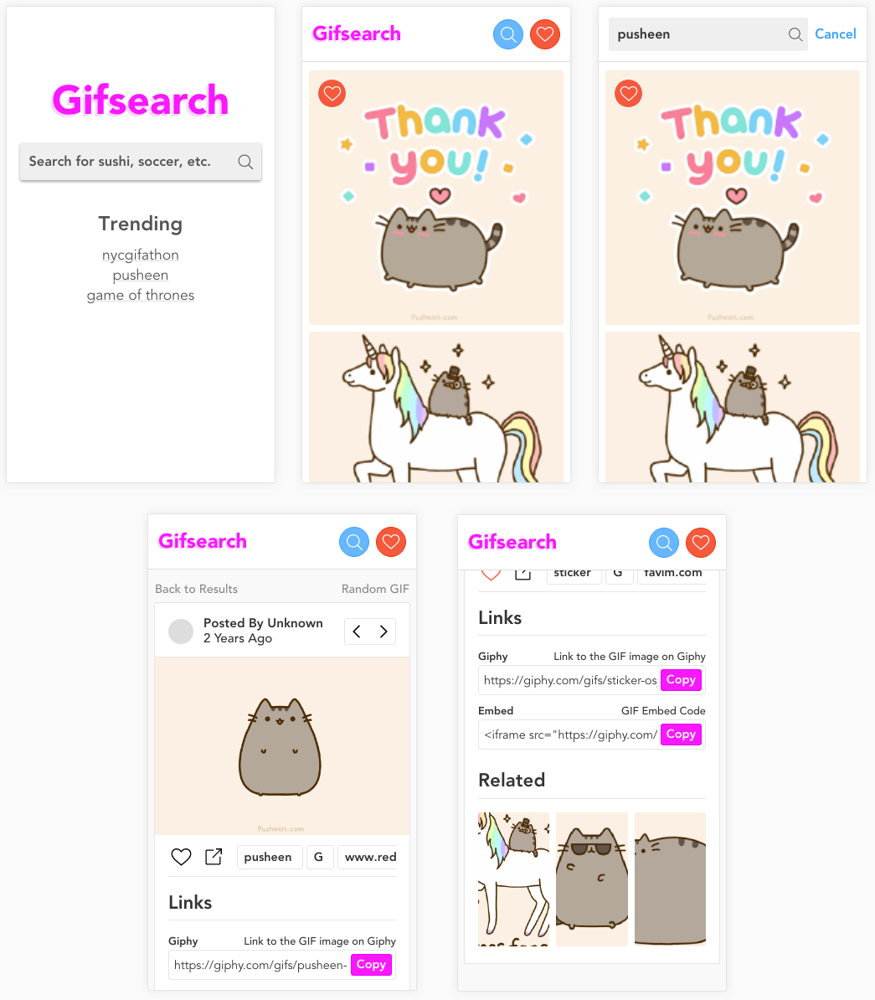

---

A GIF search web app powered by the [Giphy API](https://github.com/Giphy/GiphyAPI) and [Vue.js](http://vuejs.org/).

## Set up

Complete in order.

### 1. Install Dependencies

Gifsearch uses a tiny number of third-party libraries (not including Vue.js core).

```
"dependencies": {
  "animejs": "^2.0.2",  # for the heart animations
  "axios": "^0.16.1",  # HTTP client
  "clipboard": "^1.7.1",  # interface for copying to the clipboard
  "local-storage": "^1.4.2",  # interface for managing browser local storage
  "moment": "^2.18.1"  # simple date formatting
}
```

To install the dependencies, we first need to install [nvm](https://github.com/creationix/nvm) to manage our [Node.js](https://nodejs.org/en/) version:

```bash
$ curl -o- https://raw.githubusercontent.com/creationix/nvm/v0.33.0/install.sh | bash
$ command -v nvm  # verify that nvm was installed
$ nvm install node
$ nvm use node
$ which npm  # verify that npm was installed
```

Now we install the dependencies from the `package.json`:

```bash
$ git clone https://github.com/tmm/gifsearch.git
$ cd gifsearch
$ npm install
```

### 2. Build Instructions

```bash
$ npm run build
```

### 3. Run Instructions

Run the following (default web browser will open to `http://localhost:8080/`):

```bash
$ npm start
```

## Changelog

A brief snapshot of how the project was completed (is not exhaustive).

#### 5/26/17

Used the [Vue.js CLI](https://github.com/vuejs/vue-cli) to scaffold a simple Webpack project. Updated `webpack.config.js` to include support for [Sass](http://sass-lang.com/), asset/file loading, etc. Set up `store` with initial state and `routes` with blank pages. Fetch search data from the Giphy API.

#### 5/30/17

Add favorites to browser local storage. Create custom masonry grid layout for GIFs (see `src/components/MasonryGrid/` for more). Create GIF details page and get random GIFs.

#### 5/31/17

Implement related GIFs, favorite animation, and responsive styles. Create `README.md`.

#### Misc

To view each individual commit run:

```bash
$ git log --color --graph --pretty=format:'%Cred%h%Creset -%C(yellow)%d%Creset %s %Cgreen(%cr) %C(bold blue)<%an>%Creset' --abbrev-commit

* 0a6b7c5 - (HEAD -> master, origin/master) Finish project (34 minutes ago) <Tom Meagher>
* 35c7828 - Add favorite animation (5 hours ago) <Tom Meagher>
* 9131919 - Related gifs, start refactor (10 hours ago) <Tom Meagher>
* a8bd6fc - Random GIF (2 days ago) <Tom Meagher>
* abc5c1a - Gif details (2 days ago) <Tom Meagher>
* 21a9700 - Update grid layout, search (2 days ago) <Tom Meagher>
* a8470bc - Add favorites (6 days ago) <Tom Meagher>
* 75243ea - Initial commit (6 days ago) <Tom Meagher>
```

## Design, Tech/Tools Used, & Other Thoughts

Parting thoughts on why it looks the way it does and what I used to make it.

### Design

The goal was to create a simple, clean design: Guide the user, but stay out of the contents' way.



Masonry grid layout is familar to user and easy to browse.



Favorite animation provides a small detail that delights users.



GIF detail view allows users to browse by tags, copy links, view related GIFs, etc.



Empty state messages encourage action.



And everything looks great on mobile!



### Tech

These are the main tools. You can check out the `package.json` for specific libraries I used.

| Name | Purpose | Website |
| -- | -- | -- |
| NPM | package manager for JavaScript | https://www.npmjs.com/ |
| Webpack | JavasScript module bundler | https://webpack.github.io/ |
| Vue.js | JavaScript app framework | https://vuejs.org/ |
| Sass | CSS extension language | http://sass-lang.com/ |
| Babel | Next generation JavaScript | https://babeljs.io/ |

### Other

If a user searched for `favorites`, then the proposed routes for the search (`/:search_term`) and detail (`/:search_term/:gif_id/`) views collided with the favorites (`/favorites`) view. To solve this problem a `/g/` was added before the `/:search_term/` (i.e. `gifsearch.com/g/:search_term/:gif_id`). See `src/router/index.js` for more info.
